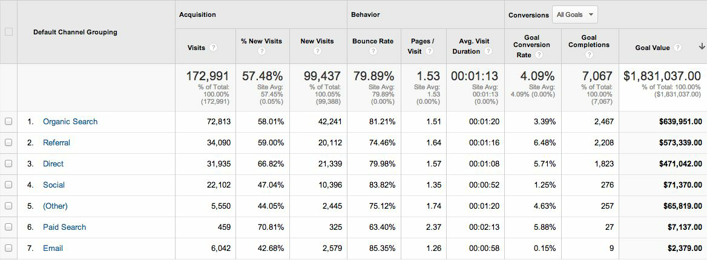

# iEvolutioned
# playbook

The who, what, why, where, when, and how of modern application development

\newpage

# playbook
## iEvolutioned
## May, 2014

\newpage

# Hello

You work at iEvolutioned. This is your playbook. It details how you and your teammates run our software consulting company and how we make web and mobile products together. It is a living document that you can edit in a private GitHub repo.

It's filled with things we've learned based on our own experience and study of others' experiences.

Our playbook is based on Thoughtbot's playbook. Their idea was that others may learn from, or use, their tactics in their own companies. While their "plays" have worked for them, we as a team have to decide which tools and techniques might work for us.

Some of our work needs to be private, such as links to various accounts like our HR system or documentation on how we handle credentials. Look in our private company Basecamp account for that kind of information.

Some of our work is very technical, but can be public. Look in our public ievolutioned/guides GitHub repo for that kind of information.

\newpage

# Time
We work a [sustainable pace](http://www.extremeprogramming.org/rules/overtime.html) of 40 hours/week Mondays to Friday.

## Consulting

We make our money on consulting projects. Those projects start with [sales](playbook.md#sales) and go through a normal flow of designing, developing, shipping, monitoring, and iterating. We should do such a good job for our clients that they will want to poach us, and be such a great place to work that we can be confident our teammates won't leave.

\newpage

# Product Design Sprint

> "Most people make the mistake of thinking design is what it looks like. People think it's this veneer — that the designers are handed this box and told, 'Make it look good!' That's not what we think design is. It's not just what it looks like and feels like. Design is how it works." - Steve Jobs

[Product Design Sprints](http://robots.thoughtbot.com/the-product-design-sprint), an invention of [Google Ventures' design team](http://www.gv.com/design/), are 5-phase exercises intended to improve the chances of [making something people want](http://paulgraham.com/good.html). We want to turn false confidence into validated confidence before beginning an expensive build. Or, we want to dodge bullets by learning we shouldn't begin the expensive build at all.

Sprints are useful starting points when kicking off a new product or workflow, as well as solving problems with an existing product. They typically last 5 days but we have done them in less time. We get as many stakeholders and expertises in the room as we can.

Product design sprints are test-driven design.

## Prep Work

Before the sprint, our clients schedule 5 real humans for the tests we'll do in the last phase. They know their users better than we do.

They also gather research from sources such as:

- [Quora](http://quora.com/)
- [Google Analytics](http://www.google.com/analytics/)
- [Adwords Keyword Planner](https://adwords.google.com/KeywordPlanner)

We may also do some (paid) prep-work:

- Schedule and run [user interviews](http://www.nngroup.com/articles/interviewing-users/).
- Deploy a [short survey](http://www.google.com/insights/consumersurveys/use_cases) whose results we can review in the first phase.

We typically order breakfast for the first day to make it feel special but don't order lunch for each day of the sprint. For both the sprints and normal days, we believe it's important to not have "working lunches", instead breaking from work for a short time to rest the brain, maybe get some fresh air, and interact with teammates and clients.

## Understand

The exercises in this phase help us understand and empathize with the users' life (consumer software) or work (business software) needs.

Throughout the phase, people take notes, often on sticky notes that they stick to the walls of the room.

We start with "pitch practice", where the client pitches their product like they would to investors. This helps us identify the user, their problem, and the job they are hiring the product to do. It also begins documenting the [vocabulary used in the domain](http://martinfowler.com/bliki/UbiquitousLanguage.html).

We then review research from Quora, Analytics, AdWords Keyword Planner, interviews, and surveys. This helps us understand users' motivation, the marketing funnel, and the size of target markets.

Lastly, we sketch what the rest of the sprint will focus on: the critical path for the software. At this point, we try to keep this high-level and as light on implementation details as possible. A great question to help generate the critical path is:

> What job is the user hiring the product to do?

We will edit the critical path as we move through the phases.

## Diverge

The exercises in this phase help us exhaust our imaginations for potential solutions that meet the users' needs.

Before this phase, the team naturally walks around the room reviewing the walls, covered in the critical path and lots of sticky notes.

We start with "pitch practice" again, comparing to the critical path.

We then have each person individually sketch 10+ [user flows](http://signalvnoise.com/posts/1926-a-shorthand-for-designing-ui-flows) and user interfaces. We ask people to include the sources where the customer will come from: Twitter? A blog post? AdWords? Automated suggestions? Drip email? Referral from a friend? Push notification?

Should the product become realized, these sources should eventually be measured in [Google Analytics' "Acquisition Channels" report:](http://analytics.blogspot.mx/2013/10/new-acquisitions-reporting-channels.html)

We then put those sketches on the wall and begin a silent critique, observing and putting [dot stickers](http://www.amazon.com/dp/B002M3SBM2) on different parts of the flows and user interfaces that we like. This helps visually identify the best ideas.

When then do a group critique, three minutes per idea. The group explains their dots. The author can then add any extra commentary. We don't shoot down any ideas or start winnowing. This voting process helps avoid long discussions and design-by-committee.

Lastly, we do a "super vote" with larger, red dot stickers. The CEO or other product owner will place a single "super vote" on what they think is the best idea. This helps us reflect the reality of how their organization makes decisions and affirm their ultimate authority.

Our experience has been that this phase is mentally exhausting. We recommend ending early and sending people home to re-charge their batteries.

## Converge
The exercises in this phase force us to stop generating new solutions, converge on the best, and write the test for the prototype.

First, we identify assumptions we're making in the best ideas. We list all assumptions about users' motivations, the business model, our ability to acquire users, and our ability to implement the solution within budget. This helps eliminate some options.

We then look for conflicts in the remaining sticky notes, user flows, and user interfaces: ideas that aim to solve the same problem in different ways. We eliminate solutions that can't be pursued currently.

We then decide whether we're creating one prototype ("best shot") or multiple ("battle royale"). Multiple prototypes are more initial work but may reveal more dead ends and help us dodge more bullets without running follow-on sprints.

We then storyboard each prototype. This is a comic book-style story of our customer moving through the critical path.

Lastly, we create the testing script in Google Docs and put the scoreboard on the wall of the observation room. The script is based on the storyboard and the scoreboard will be used to record the results of the test. This helps us be very explicit about what we're trying to learn.

## Prototype

After another pitch practice to rally the troops, there are no exercises in this phase. It is entirely focused on building the right prototype(s) with just the right amount of fidelity to generate useful test results.
	
For the entire phase, we ask our clients to write copy text in Google Docs. They write [real text, not lorem ipsum](http://gettingreal.37signals.com/ch11_Use_Real_Words.php), in order to test user understanding and enthusiasm. This text is also useful later for tweets, press, ad copy, landing pages, etc.

While our clients are busy getting communication polished, we are heads-down prototyping. We use different tools depending on the designer and the project.

For web app prototypes, some good options are:

- Squarespace templates
- Bourbon + Neat + Bitters locally
- Invision

For mobile app prototypes, some good options are:
- Flinto + Sketch + iOS 7 template
- Prototyping on Paper

Don't try to learn these tools during the sprint. Get familiar with them during investment time. During the sprint, use one that you've mastered.

## Test and Learn

Finally, we interview 5 users to test our understanding of them, their context, and our prototype. This is not a usability test. We begin the conversation as an interview before showing them the prototype.

One of our designers interviews each user. We set them up in an interview room with video and audio streaming to the observation, where the rest of the stakeholders are watching, discussing, and recording answers on the scoreboard.

Good questions are open-ended to allow users to tell stories.

"Could you tell us about a time you donated to a non-profit?"

Don't lead users to an expected answer.

"Would you donate money to a public school if you could?"

Don't close the conversation.

"Have you donated money to an organization within the last week?"

For a new product, it's unlikely that any team will nail it their first sprint.The most likely outcome is that we'll want to run a follow-on sprint starting at Diverge or Converge and test again with a new users.

After one or two sprints, we typically have many assumptions validated, a clear critical path established, and are ready to begin coding a first version to release to a wider audience.

For web apps, we can typically ship a first version in 4-6 weeks. For mobile apps, we can typically ship a beta via HockeyApp in 6-8 weeks and ship to the App Store in 8-10 weeks.

Given those timelines, spending an extra 2-5 days doing a second or even third truncated product design sprint is worth the opportunity cost of spending 4x-10x more time and money to learn we bombed.

Another outcome is that there's no clear user pain, or the business model is murky, or everything we thought we knew was proven wrong. That's an emotional blow, but a success. Time and money were saved.

We end the phase with a plan for moving forward.

\newpage

# Choose Platforms

Very early, we have to decide on which platforms we'll depend.
The answer depends on our ideas for solving these users' problems. For example, if they're construction workers on a job site, a mobile or tablet interface might be the best choice.

After considering what's best for users, what's best for us?
- The tools are open source with a strong community
- The tools make the designers and developers happy
- The tools make it easy to create and iterate quickly

Open source tends to be higher-quality software that is on the cutting edge of technology and best practices. It also helps avoid vendor lock-in.

Tools that make makers happy also make them more productive.

## Web Apps

In our experience, Ruby on Rails web apps tend to be fast to market and have a low total cost of ownership because they are highly conventional. One Rails app's codebase looks very similar to other Rails app's codebases. There's also strong overlap between agile and Ruby communities, which means, among things, that Ruby developers tend to write tests, use object-oriented design, and avoid repeated code.

Maybe the greatest compliment we can pay to Rails is that we've made a huge financial commitment to it, essentially betting the future of the company on it in 2005. We're still here.

In return, we're proud of our contributions to the community, in particular our open source libraries and articles on GIANT ROBOTS SMASHING INTO OTHER GIANT ROBOTS.

In addition to Ruby, we use other open source software (OSS) and web standards such as HTML, CSS, JavaScript, UNIX, Vim, and Postgres because they:
- Are high quality.
- Avoid vendor lock-in.
- Provide flexibility to switch components.
- Work on many devices.
- Are battle-tested.
- Have few bugs when seen by many eyes.

Ruby on Rails comes with features that decrease the burden on the programmer to protect against security attacks such as:

- Cross-Site Scripting (XSS)
- Cross-Site Request Forgery (CSRF)
- SQL injection
- Header injection
- Sensitive data in logs

While Rails makes "doing the right thing" easy with regards to security, we are still required to be diligent, knowledgeable, and test comprehensively. For more information, see the Ruby on Rails Security Guide.

We support Internet Explorer 9.0+ and the latest versions of Firefox, Chrome, and Safari. We do not support Internet Explorer 6, 7, or 8. Instead, those users see a polite message showing them how to upgrade. Those browsers are losing market share, they have security issues, and they are time-consuming to design for, develop for, and support.

In limited special cases, user demographics will dictate that supporting an older version of Internet Explorer is required. Those special cases should be identified early on and additional time and expense will be needed in order to support the version.

## Mobile Apps

 "Mobile" refers to the user, not the device.

Everything about how we design a mobile application has to be in the context of that idea. It raises questions like:

- Are they moving?
- Are they relaxed on a couch?
- How dexterous are their fingers?

We try to start with the most usable platform first. If the device needs the camera, calendar, or address book, a "native" app like an iPhone or iPad app may be the right choice.

For other products (especially prototypes), a mobile web app makes sense because:

- All modern smart phones can render HTML.
- Bourbon and Neat make "responsive" designs easy to implement.
- We can create and iterate quickly.
- We can deploy new versions multiple times a day.
- We can expose an API so third parties can create Android, iPhone, Blackberry, Windows Phone, and Symbian apps on the business' behalf.
- HTML5 makes features available that were previously only available "natively" such as GPS (geo-location) and the accelerometer.

A downside to the cheapness of building and iterating on mobile web is that the team will have a tendency to add features that will be difficult to kill when transitioning to native mobile.

Our mobile developers' expertise is with the Objective-C programming language and iOS frameworks such as Cocoa. We don't take on Titanium or PhoneGap projects because of:

- Cost: it is a costly burden on our designers to try to design for the iOS and Android platforms at the same time. The differences in screen sizes, resolutions, aspect ratios, and expected user interface patterns require different design solutions.

- Early access to upgrades: Apple's NDA forces 3rd party apps like Titanium to wait until new iOS versions are released to the public before they can code against them. Working the way Apple recommends, we get access to new versions months early. We can use new features earlier to make the app feel more modern. We can use the new ways of doing things to save lines of code and time.

- Quality: Appcelerator, like past cross-platform technologies such as Adobe Air or Adobe Flash, provide a least-common denominator user experience. They may or may not be compiled to "native" code but they rarely achieve a "native" feel.

## Programming Languages

Examples of languages we typically use are:

- Ruby: our server-side preference
- JavaScript: our client-side preference
- Objective-C: the language for iOS apps

"Server-side" means code that is run on servers provided by the application hosting company. "Client-side" means code that is run in users' web browsers.

## Frameworks
Ruby on Rails, Node.js, and other libraries are frameworks that require developers know the underlying language such as Ruby or JavaScript.

Examples of frameworks we typically use are:

- Ruby on Rails
- jQuery
- iOS Core Data

A framework is a library that makes performing a particular task in a programming language easier. Just like the framework of a house, it's there when we begin programming and is always there giving the program structure and support.

It can be difficult to switch from one framework to another. The more code that's written specifically for Rails, the harder it will be to switch to Django. That would approach "total rewrite" territory. If an app is lightly using Prototype for client-side interaction, it is relatively easy to switch to jQuery.

## Databases

For data that absolutely must be saved and stored correctly, we use PostgreSQL (we usually refer to it as "Postgres").

It's a 30 year old open source database that is highly respected, well supported by documentation and hosting providers, and easily used by any developer who knows the SQL standard.

In recent years, a movement called NoSQL has gained popularity. Best translated as "not only SQL", tremendous effort has been made to create different kinds of databases for different use cases.

They are often based off academic or industry research. This is the best collection of NoSQL papers we've seen.

Our most frequently used NoSQL database is Redis, which we use for storing transient, high read/write data like activity feeds, tags, background jobs, sessions, tokens, and counters. Redis provides tremendous speed from in-memory operations, and also provides point-in-time snapshots of our dataset at specified intervals for persistence.

Redis is reliable, open-source, and simple. It's easy to predict how it will perform, and it can flexibly model different data sets. We typically use Redis to Go to host our production Redis databases.

## Licenses

In contrast with a proprietary license, the source code of the program is made available for review, modification and redistribution. The difference between open source licenses is what we can and can't do with the source code.

Open source licenses can be divided in two categories: permissive and copyleft. Permissive examples include:

- Berkeley Software Distribution (BSD) licenses
- MIT license
- Apache license

A copyleft example is the General Public License (GPL).

They all have the purpose of establishing the copyright holder for the software, granting users the right to copy, modify and redistribute it, protecting the copyright holder from any potential guarantees that the software may provide (software is provided as-is), and optionally imposing some restrictions.

Permissive licenses let us modify a program, redistribute it, and even sell it. We can embed or link code with other programs without restriction or explicit permission by the copyright holder.

Copyleft licenses only allow us to link or distribute code with other code that has the same license. It also forces modifications to be released under the same license. Combining anything with the GPL makes it GPL.

Non-copyleft licenses do not enforce derivative works to also be open source.

Some software is released under a dual license: both a permissive and copyleft license. This provides developers who use the dual licensed code to apply the license that better suits their needs.

Most of the software we use has a permissive license:
- Git, GPL v2
- Linux, GPL v2
- PostgreSQL, PostgreSQL License (BSD based)
- Redis, BSD
- Ruby (MRI), Ruby license (BSD based)
- Ruby on Rails, MIT
- jQuery, Dual MIT and GPL
 
 \newpage

# Laptop Setup

Your laptop is your sword. Don't go into battle without it. Set up your laptop with this script and these dotfiles.

## Laptop

Laptop is a script to set up a Mac OS X or Linux laptop for Rails development. It should take less than 15 minutes to install.

This sets up compilers, databases, programming languages, package management systems, installers, and other critical programs to our daily programming activities.

## Dotfiles

'Dotfile' is a generalized term for a UNIX configuration file, typically prefixed with a dot (e.g. .vimrc) and found in your home directory. Most UNIX programs, including Vim, will load a dotfile during launch.
	
We recommend using dotfiles to customize your tools and environment to suit your preferences, reduce typing, and get work done. Check them into a git repository for safe-keeping and open-source for the benefit of others.

Use our dotfiles to make pair programming with teammates easier and make each other more productive.

## Text Editor

> Plain text won't become obsolete. It helps leverage your work and simplifies debugging and testing. The editor should be an extension of your hand; make sure your editor is configurable, extensible, and programmable. -The Pragmatic Programmer

Almost everyone at thoughtbot uses Vim as our text editor.

When we use Vim, we type few characters and avoid the mouse. We're productive and more easily achieve flow.

It's great because:

- Vim is tiny (1.6MB) and starts up instantly.
- Vim is a well-polished stone by virtue of how long it has been around. It was introduced in 1991 as an improvement on Vi, which itself was written in 1976 by Bill Joy.
- It has a rich ecosystem of open-source plugins.

\newpage 

# Planning

One of our primary process goals is to make frequent, small releases of our working software.

This section describes how we achieve one week's worth of iteration on a product. It lays out the process we follow and some communication tactics.

## Daily Standups

Every morning, we get together as a team for 10 minutes at 10 AM.

We say what we did yesterday, what we're going to do today, and if anything is blocking us. We immediately resolve blockers or help the person after standup.

We do this in order to:

- See each other face-to-face.
- Learn what others are doing so you can help them.
- Build accountability and trust.

## Tasks

We have used JIRA, Pivotal Tracker, Lighthouse, Basecamp, Trajectory, Unfuddle, and other task management systems over the years. The following section details a process using Trello but the overall process remains relatively similar across different systems.

No two products are the same, so flexibility in the product development process is important. Trello responds well to changing the structure of the process "on the fly."

A Trello board is a software equivalent of a physical wall with columns of sticky notes. In Trello terminology, the wall is called a "board." The columns are called "lists." The sticky notes in columns are called "cards."

In the following image, "Current" is an example of a board. "In Progress" is an example of a list. "Set up Splunk for logging" is an example of a card.

[Next Up Trello board](assets/Next Up Trello board.png)

In any task management system, it's important to have a view into the product development process like this. The Next Up list is the single prioritized list to which the product team refers in order to know what to work on next. It represents one week of work.

A card represents a user story, bug fix, engineering task, or general todo.

Cards start out as a simple idea, 1-2 sentences long. As they are pulled through boards, detail is added, explaining why (from a business perspective) we're focusing on it, and maybe notes on suggested implementation (though designers and developers may take or leave it at their discretion; it's supposed to be helpful, not prescriptive).

[Live Trello board](assets/Live_Board.png)

Once the cards in the Next Up list have been prioritized and vetted, they are ready for design and development. A designer or developer "puts their face on it" by assigning it to themselves and pulling it into the In Progress list.

The cards in the In Progress list are actively being designed or developed. Etiquette is that you should never have your face on more than two cards at a time. Work is done in a feature branch.

When a designer or developer creates a pull request for their feature branch, they move the card to the Code Review list. Any reviewers "put their face on it" while reviewing.

There is no bottleneck for merging into master: everyone can do it.

The cards in the Testing on Staging (or Testing on Ad Hoc build for iPhone apps) list are deployed to staging (or distributed via HockeyApp for iPhone apps). The card creator and a designer review it for accuracy and user experience.

There is no bottleneck for deploying to staging: everyone can do it.

The cards in the Ready for Production list include cards that have been accepted on staging and are ready to be deployed (but not necessarily rolled out).

There is no bottleneck for releasing to production: everyone can do it.

The cards in the Live (Week of [date]) lists have been released. Each week has its own Live list so we can follow what got released when.

## Weekly Retrospectives

Once a week, usually on Monday, everyone meets in-person or via Google Hangout for 30 minutes or less. This replaces Monday's daily standup. Everyone should leave feeling energized and excited for the week.

The advisor runs this meeting like this:

Celebrate success. Review the work that shipped last week, showing the actual product, and congratulate those who made it happen.

Identify and address areas for improvement.

## Planning Meeting

Once a week, usually on Thursday, everyone meets in-person or via Google Hangout for 60 minutes or less. This gives the week closure and plans the upcoming week's iteration. The advisor runs the meeting.

The stage of the product should guide the planning meeting. For example:

1. Research and Validation: Is a user interface flow validated enough to start making a minimal working version?
2. Product Availability: Can users accomplish the flow with working, deployed software?
3. User Engagement: What do numbers look like for that flow?

Tell customer stories. Do people love this product? Show numbers. Are more people using the product this week than last? Are the same people using the product more this week than last?

In all stages, we should be asking:

- Are we building the right product?
- How much time remains based on the budget?

Based on the answers to these questions, we record our plans in the task management system:

- Archive the two-week old "Live (Week of [date])" list.
- Review product design priorities. Pull what we estimate to be an appropriate amount for this week into Next Up.
- Review bugs. Pull any important bugs into Next Up and prioritize then at the top of the queue before everything else. We want to always be fixing what's broken first.
- Review engineering and refactoring tasks. Pull cards into Next Up based on what the designers and developers believe is appropriate given the previously stated product design and bug tasks.
- Re-sort the entire Next Up queue according to priority. Cards that were at the top of the list last week may be moved to the bottom or back to other boards or lists.

The task management system is the canonical repository for plans.

When things are only said on the phone, in person, in emails that don't include the whole group, or in one-on-one chats, information gets lost, forgotten, or misinterpreted. The problems expand when someone joins or leaves the project.

During this meeting, seek discussion with, not instruction from, clients. We can't talk about solutions until we identify the underlying problems.

We've been called "aggressive" with our approach cutting features, budgets, and schedules. We say "no" a lot. It's hard to say "no." "No" is usually not well-received. There's a reason someone requested the feature.

We have to battle sometimes in the face of "yes". We do so armed with knowledge of the history of software success and failure: in 2004, only 34% of software projects were considered successes. The good news is that was 100% better than the stats in 1994. "The primary reason is the projects have gotten a lot smaller."

Few software projects fail because they aren't complicated enough. Saying "no" means keeping the software we're building as simple as possible. Every line of code we write is an asset and a liability.

Simple software, once launched, is better suited to meeting the demands of customers. Complex software, if it ever even launches, is not as able to respond to customer demands quickly.

## Altering the Process

A single Trello board with a few lists as described above works well for most early-stage teams and products. As they grow, however, more organizational tools may be necessary. For example, we might want to first add lists to the "Current" board such as:

- Bugs
- Product Design
- Engineering

Later on, those lists might be better organized as entire boards themselves. Separated as boards, it's easier to evaluate the relative value of addressing each related thing. Separate boards also keep the "Current" board clean and the product team focused on the week at hand.

Each of those boards can be organized as the team sees fit for the stage of the product and the team's communication needs.

On the "Bugs" board, we've sometimes used labels to describe relative criticality of the bug. If a bug is labeled Critical, then it is pulled immediately into Next Up on the "Current" board. If the bug is not critical, it stays in Bugs until the next weekly retrospective. A bug has steps to reproduce the bug and optionally a screenshot or screencast.

The cards on the "Product Design" board are typically the result of sketching user flows, usability tests, other user research, or the designer's feel for visual design improvements.

The cards on the "Engineering" board are refactorings and other engineering tasks necessary to reduce bugs or improve the user experience. "Response time" is a primary user experience goal on every app. If an engineering task is labeled Critical, then it is pulled immediately to Next Up. If the task is not critical, it stays in Engineering until the next weekly retrospective.

\newpage

# Designing

This may surprise you, but most of our designers use Vim as their primary text editor. This isn't the only characteristic that has become distinctly thoughtbot.

Many of our projects are frequently undergoing rapid change. Without classic Photoshop comps or requirements documents, how do our designers fit into the process?

## Sketches

Just like during the product design sprint, our designers are often sketching interfaces before implementing them. Also like the sprint, anyone on the team is encouraged to sketch at any time.

We have many Moleskine squared, soft, pocket-sized notebooks around the offices. Take one. The pocket size encourages the habit of getting ideas onto paper whenever and wherever they hit us. The pocket size also forces design constraints and mobile-first thinking.

## Wireframes

The designer will then refine the sketches into HTML and CSS wireframes. HTML and CSS wireframes are built using Bourbon and Neat in the browser so the team can get understand the core experience as fast as possible. It also allows developers to start implementing features within the wireframes.

It is crucial to keep the design of the application ahead of the development. Focus should be placed on wireframing usability, user experience, and flows.

We find it important to keep the design and development cycle adequately tight. We do not wireframe one month out because as we approach certain areas of the product, we often decide to cut or change features.

Those changes are an expected part of the iterative process and feedback loop between the client, the thoughtbot team, and users. It would be wasteful to spend time wireframing features that never get built or building features that won't be used.

## User Interface

> An interface is a place where two things meet: the human and the computer. The computer has functions it can perform. The human needs inputs and outputs to take advantage of those functions. The interface is the arrangement of inputs and outputs that enable people to apply the computer's functions to create outcomes they want. - Ryan Singer

In the context of our software, the user interface is the individual views that provide for goal completion.

We evaluate interfaces on the following criteria:

- Puts outcomes first
- Provides users with affordances
- Congruent with surrounding platform
- Consistent across entire application

We put the users goals first. No one is using our software exclusively because of how beautiful it is. There's a reason they sought our solution out. Making that outcome easily attainable and desirable is our highest priority.

We make software easy to comprehend. It's not enough to be functional, users must know capabilities exist and be able to anticipate how the software is going to react to their inputs. Our software should be as intuitive as possible.

We remain consistent with platform guidelines. Interfaces look and feel best when in congruence with their context, rather than being strictly branded across all platforms. We prefer common patterns when designing.

We retain consistency. Usable interfaces work as expected across the entire application.

## Interaction Design

Interaction gives users the ability to change the canvas, to directly manipulate. Designing those interactions is what makes our software come to life. Interactions should provide affordance — animation, for examples, can be used as a powerful metaphor for helping a user understand an interface. Interactions help guide a user from the beginning of a task through it's completion.

Designers guide these interactions from prototype to implementation. For web applications we start in the browser. For iOS, we use QuartzComposer. For review, we use gifs to demonstrate interactions.

## Visual Design

We refer to an application's visual design exclusively as its style. We use the universal design principles to communicate and bring order to those ideas in our applications.

Those fundamentals include, among others:

- Alignment (often achieved with grids)
- Emphasis (often achieved with size, position, color)
- Consistency (buttons, links, headers typically look alike)
- Whitespace (elegant, timeless, gives eye a rest)

Successful visual designs typically don't draw attention to themselves. The content will be front-and-center. The workflows through the site will be obvious. Resist the temptation to aim for a design that is "memorable" or a design that "pops."

Successful designs are usable. Consider Google's visual design:

### Gmail
Everything's on a grid. The "Search Mail" and "Compose Mail" buttons are emphasized over other calls to action with color. The unread messages are emphasized over other messages with a bold font weight.

### Google Search
Everything's on a grid. There is lots of whitespace (especially with AdBlock). Search interface is consistent with Gmail. Search button is emphasized with color.

### Google Video
Grids. Whitespace. Consistent search box, search filters, search results.

###	Google Places
Grids. Whitespace. Emphasis on searching and writing a review.

We say "visual design" instead of "graphic design" because typically graphics aren't called for in our applications. Instead, we rely on these principles and excellent typography, using high-quality typefaces from Typekit and typography.com.

## Usability Testing

> We're testing the software, not you.

Usability is the measure of how easy it is for a user to reach an outcome.

Running usability tests early and often is critical. We even test sketches to get a feel for flows and mental models. The earlier the stage, the more we're testing the problem/solution fit. The later the stage, the more we're testing actual usability.

We think about usability testing similarly to test-driven development: writing falsifiable outcomes for users. Our outcomes are written in the form of a script that's written in the same way as a user story.

> As an admin I can create an account, add content, and attach .pdf files to that content

Once the script is written, we find testers.

The most representative candidates are going to be sourced from our existing userbase. Send out a tweet, add a banner to our site, or add a link to our newsletter. Even pre-launched projects have a mailing list to use.

When we have trouble sourcing or aren't interested in existing users, Craigslist can be effective to find candidates. Our office manager puts a posting on Craigslist, schedules them to come into our office, and pays them $30 for their time after the test.

We have a simple template for finding people on Craigslist.

After the tester has arrived, we introduce ourselves and explain the process. There's no need to be strictly formal, we want them to be at ease. To have a relaxed user test, it's important to remind the user of a few things:

- "We are looking for your honest feedback."
- "None of what you're about to see was made by me. There's no way you can hurt my feelings."
- "We're testing the software, not you. It's not user testing, it's usability testing."

Once underway, we ask them to say out loud what they're thinking as they're using the software, which can feel unnatural but is important. While running the session, the only reasons to speak are to get them to talk out loud again, ask questions, and provide them with outcomes to achieve.

We should avoid leading questions such as "Was this task difficult for you?" but should ask follow-up questions. For example, if someone says "That's awesome!", we shouldn't silently pat ourselves on the back. We should say "Why is it awesome for you?" We are seeking understanding.

After the session, we look back at our notes to identify the top handful of problems and fix them before the next round of usability tests. If there's a problem revealed with the navigation, there's a temptation to totally re-do it. We try to resist that urge and come up with less drastic changes.

\newpage

# Developing

The majority of our development practices were first detailed in Kent Beck's classic Extreme Programming Explained: Embrace Change. We've tried its practices and found that using most of the practices most of the time improves the quality of our work and happiness of our team.

## Version Control

We always use source code control. It's like a time machine. We can work in parallel universes of our source code, experimenting without fear of losing work. Roll back if something goes wrong.

Git is an open source source code control system written by Linus Torvalds. It's fast and makes branching really easy.

We use GitHub for hosting our git repositories.

## Style Guide
We write code in a consistent style that emphasizes cleanliness and team communication.

High level guidelines:
- Be consistent.
- Don't rewrite existing code to follow this guide.
- Don't violate a guideline without a good reason.
- A reason is good when you can convince a teammate.

## Pair Programming

Code that is written by two people who sit next to each at the same computer is pair-programmed code. That code is considered high quality and should result in cost savings due to less maintenance.

In the long run, this style of development saves money because fewer bugs are written and therefore do not need to be fixed later.

An indication that pairing is beneficial and should be done more often is the following example:

> When you are writing an important piece of code, don't you want another person to look it over before it goes into production?

While we don't pair program 100% of the time, we recognize the difficulty in acting as a team when we work at a distance from each other. There is no better collaboration between designers, developers, or between designers and developers than at the keyboard.

## Test-Driven Development

Test-Driven Development (TDD) is perhaps the most important Extreme Programming (XP) rule that we practice.

Business benefits of TDD:
- Deliver more value, faster
- Always ship working software
- Adapt to change quickly

Code benefits of TDD:
- Readable specs and code
- Clean public interfaces
- Decoupled modules

Process benefits of TDD:
- Regression safety net
- Fearless refactoring
- Team trust

At a high level, how to test is very simple:
- Write test first.
- Red-Green-Refactor cycle.

For more specifics, we recommend our Test-Driven Rails workshop, which we run about once a month. It goes into incredible detail about the TDD workflow specifically for Ruby on Rails developers.

## Acceptance Tests
Acceptance tests are code created from user stories. They look like this. This code is run against the application. When executed for the first time, the test will fail. The developer writes application code until the test passes.

When the test passes, the developer commits the code into version control with a message such as:
- Guest creates pledge

The code is then run on the Continuous Integration server to make sure the acceptance test still passes in an environment that matches the production environment.

Meanwhile, the code is pushed to the staging environment and the developer and customer representative smoke test it in the browser.

When the acceptance test is green for the CI server and you and any other designers, developers, or clients are satisfied that the user story is complete on staging, the feature can be deployed to production at will. This can result in features being pushed to production very frequently, and therefore more value is being delivered to customers sooner.

## Refactoring
The third step of the "red, green, refactor" step is refactoring, the process of improving the design of existing code without altering its external behavior. It's a critical step in the process, but often overlooked. We're so passionate about refactoring, we wrote an entire book on it, Ruby Science.

## Code Reviews
Here's the flow. Read our git protocol for the git commands.

1. Create a local feature branch based off master.
2. When feature is complete and tests pass, stage the changes.
3. When you've staged the changes, commit them.
4. Write a good commit message.
5. Share your branch.
6. Submit a GitHub pull request.
7. Ask for a code review in Campfire.
8. A team member other than the author reviews the pull request. They follow Code Review guidelines to avoid miscommunication.
9. They make comments and ask questions directly on lines of code in the GitHub web interface or in Campfire.
10. When satisfied, they comment on the pull request "Ready to merge."
11. Rebase interactively. Squash commits like "Fix whitespace" into one or a small number of valuable commit(s). Edit commit messages to reveal intent.
12. View a list of new commits. View changed files. Merge branch into master.
13. Delete your remote feature branch.
14. Delete your local feature branch.

Test-Driven Development moves code failure earlier in the development process. It's better to have a failing test on your development machine than in production. It also allows you to have tighter feedback cycles.

Code reviews that happen right before code goes into master offer similar benefits:
- The whole team learns about new code as it is written.
- Mistakes are caught earlier.
- Coding standards are more likely to be established, discussed, and followed.
- Feedback from this style of code review is far more likely to be applied.
- No one forgets context ("Why did we write this?") since it's fresh in the author's mind.

## Continuous Integration

Martin Fowler has an extensive description of Continuous Integration. The basics are:

- We have a test suite that each developer runs on their own machine.
- When they commit their code to a shared version control repository, the tests are run again, "integrated" with code from other developers.

This helps ensure there's nothing specific to the developer's machine making the tests pass. The code in version control needs to run cleanly in production later so before the code is allowed to be deployed to production, it is run on a CI server or service.

When a build fails, we get alerts in Campfire and via email. Click the alert and we see a backtrace that gives us a hint of how to "fix the build."

When we write the fix and commit to version control again, we'll get a "passing build" alert in Campfire and via email. Click the alert and we see the passing build.

Green is good.

A solid test suite is an absolute requirement for a web application in our opinion. However, one major problem with test suites is that they get slow as they get large.

CI can ease the pain by distributing the test runs in parallel. We've had 45 minute test suites cut down to 2 minutes using this technique.

We've used CruiseControl, Integrity, Hudson (now called Jenkins), and other CI libraries that we manage ourselves. This resulted in many hours of expensive attention.

We use Travis CI for open source projects. We use TDDium for private repos and slower suites because it has the most advanced test parallelization of any hosted CI service, which runs tests faster and saves us time.

CI test runs are triggered by GitHub post-receive hooks. The hooks we have on most of our GitHub repos are:

- Travis or TDDium for Continuous Integration
- Code Climate for code quality and security checks
- Campfire for chat room notifications

\newpage 

# Production

We live in a magical modern era where many problems have already been solved for us. We focus on the client's product as much as possible and outsource operations as much as possible to external services.

This saves time and money. We can get started using those services in minutes. Our clients pay a service tens or hundreds of dollars per month instead of paying developers thousands or tens of thousands.

We often create a Google spreadsheet listing the monthly cost, description, and credentials of each of our clients' external services. It includes line items like GitHub, Heroku, SendGrid, New Relic, Airbrake, and Splunk.

## Checklist

We have found that a short checklist is valuable when setting up a new production environment or preparing for a launch:

- Are we on the Heroku Cedar stack?
- Are we using a concurrent web server? See how to set up Unicorn.
- Are long-running processes such as email delivery being run in background jobs? See how to set up Delayed Job.
- Are there redundant (at least two) web and background processes running?
- Are we using SSL? See "SSL Certificates" section below.
- Are API requests being made via a separate subdomain (api.example.com)? Even if the same app, this gives us architectural flexibility in the future.
- Is Ruby 2.1.0 defined in the Gemfile? See how to set it up.
- Is config stored in environment variables? See Foreman.
- Are deploys done manually at a scheduled time when teammates are fresh and available if something goes wrong?
- Do deploys follow a well-documented script?
- Are we sending logs to a remote logging service? See How to Splunk with Heroku.
- Are we using a Heroku "Yanari" database or higher? See Heroku production databases.
- Are we backing up our production database? See PG Backups.
- Are we monitoring performance and uptime? See New Relic.
- Are we tracking errors? See Airbrake.

## Domain Names

Use Domainr to see what's available.

Use DNSimple to buy and maintain domain names name. If a client already has a domain registered elsewhere, like GoDaddy, DNSimple provides a transfer service that makes it easy to switch.

We like it for its simplicity. It also has templates we most often need:
- Heroku
- Google Apps
- Tumblr

Follow the Custom Domains tutorial to set up root and subdomains on Heroku.

## SSL Certificates

Buy a wildcard certificate from DNSimple. The wildcard (*) lets you use the same certificate on www., staging., api., and any other future subdomains.

Follow these steps for adding a DNSimple SSL certificate to Heroku.

SSL and DNS are tightly coupled. If we're doing any work with SSL, we need to make sure we have access to make DNS changes, like adding a CNAME record. If we're working with a client who has a department that handles DNS, schedule time during off-peak hours to pair program with the DNS person to make sure everything goes well. We can accidentally take down a site that is all SSL if this work isn't done methodically.

## Hosting

We use Heroku. It's a platform built on Amazon's cloud infrastructure. It is simple to use when our app is just a toy and is built to scale up for high concurrency or high sustained load.

Like Rails, Heroku uses conventions to make decisions for us that are unnecessary for us to make. Some things like web servers and app servers are solved problems. They act as our outsourced operations team. The amount of time we can focus on the product instead of solved problems is worth the premium over bare-bones Amazon Web Services.

The cloud promises lower operating costs, especially at the beginning when capacity can be lower. Forget about sunk costs of expensive servers.

The cloud and the services it enables will empower our clients' businesses to start and operate in a manner that has never been possible before without significant upfront investment.

If we offer file uploads for features like user avatars, we upload them to Amazon S3.

We also serve our images, CSS, and JavaScript assets from a CDN such as Fastly.

## Performance Monitoring

We use NewRelic (Free-$100s/month) to monitor performance of production applications.

Debugging performance might be the best part of a developer's job. There's a clear, numeric problem. When we fix it, that number improves. We can say things like "We made this 175% better."

There's many established techniques for fixing performance problems. A number of them come "for free" with Rails + Heroku:
- Amazon server clusters
- gzipping
- Asset pipeline
- SQL query caching

A number of them require developer thought:
- Database indexing
- Eager loading
- HTTP caching
- Page caching is the heaviest handed technique we have, but if we can cache an entire page and push it into a CDN, that will be the fastest option.

## Error Tracking
We use Airbrake (Free-$25/month).

## Transactional Email
We use SendGrid (Free-$400/month) to have our application deliver email to users, known as transactional email.

Examples of transactional email are:

- Confirmations
- Follow ups after the first 3 days of use
- Free trial is expiring
- Message another user in the system

We use SendGrid directly, not via the Heroku add-on, in order to avoid being lumped under the same IP group as others on Heroku (who might be misbehaving).

## Payment Processing

For collecting payments from users via credit or debit card, we use Stripe. It is a payment gateway and merchant account. We also use it for recurring billing.

Charges for Stripe will vary depending on usage. Successful charges are 2.9% + 30 cents. There are no setup fees, monthly fees, or card storage fees.

For sending money to users' bank accounts via ACH, we use Balanced.

\newpage

# Measuring
> "If you can not measure it, you can not improve it." -- Lord Kelvin

The difficult part of measuring is deciding what to track.

Dave McClure's AARRR framework provides a high-level overview of important metrics. We then use tactics such as event tracking to instrument those metrics.

## AARRR

The AARR framework is:

- Acquisition
- Activation
- Retention
- Revenue
- Referral

For an early stage product, we work to improve them in this order:
1. Activation: visitor finds the product desirable enough to try, is able to use it and get to aha moment in shortest time possible
2. Retention: user regularly uses product, it is doing the job they hired it for, customer is happy
3. Revenue: user pays for product
4. Acquisition: we know where our users come from, are able to try new channels, run tests, and kill or double-down on different channels
5. Referral: users refer other users, the ideal acquisition channel

## Instrumentation
In order to analyze metrics later, we need to instrument our app to log the right metrics. The primary type of instrumentation we care about is called "event tracking."

Use Segment.io to capture events whenever possible. It is basically the adapter pattern for analytics services.

Segment.io lets us drop one JS library into our web apps, or one Ruby library into our server-side framework, or one iOS SDK into our mobile apps. Then, we can toggle on and off different services such as Google Analytics, Mixpanel, Intercom, Olark, Localytics, and others.

Segment.io

Segment.io's API endpoint is hosted on Amazon CloudFront. So, it has extremely good uptime and you can have Segment pipe the CloudFront logs for your apps to your own S3 bucket, giving you access to your raw logs.

When Segment.io does not support a backend service, we can either use the service directly or contribute to the appropriate Segment.io open source libraries.

The hardest part of event tracking is choosing the granularity of the events. It's costly to reconstruct historical measurements and missed knowledge can kill an early-stage product. So:

- track events as soon as they exist in the product
- err on the side of more data than less
- include as much state as possible per event
- own the data from the start

Some typical events we'll want to track:
- open app (mobile)
- background app (mobile)
- pageviews (web)
- create account
- make purchase
- add content
- make connection/friend
- upgrade subscription
- refer friend

Use properties on events liberally. Typically include:
- session ID
- all user properties
- environment: operating system, app version, device hardware details,
- current battery, wifi, cellular status
- number of seconds into the session

Business analytics do not need to be realtime and tracking this data should not slow down the user experience. So, we background these tasks whenever possible using whatever backgrounding system makes sense for our platform. Examples include Delayed Job and IronWorker.

## Subscription Metrics
We work on a lot of products that have a monthly and/or yearly subscription business model. There are some classic metrics we know we want to track for these products, such as:

- Monthly Recurring Revenue (MRR)
- Active subscriptions
- Lifetime Value (LTV)
- Churn per-plan, monthly and annually

Since we use Stripe for payments, we've found Baremetrics is the fastest and easiest way to track these metrics.

If our clients want to raise money from investors, the following numbers are generally considered investment-ready:

- LTV is 3x-5x greater than Customer Acquisition Cost (CAC)
- 10-30% month-over-month growth in MRR
- 5-7% annual churn

Churn is particularly critical when fundraising. Small changes in churn can drastically improve valuation.

Calculating CAC is a manual spreadsheet exercise. It requires adding employee overhead costs and direct marketing costs together, then dividing by the number of new customers for that month.

For Learn, we can rely on our bookkeeper, AccountingDepartment.com to provide us with those numbers, and make adjustments for which vendors such as Google (AdWords), Twitter, or AdRoll fall under the direct marketing accounting class.

## A/B Testing

Someone can tell us in a usability test when they're confused by a page or when they're frustrated by upsells during the checkout process. They probably can't tell us whether one set of copy or another is more likely to make them feel an affinity with our landing page, pull out their wallet, and plunk down cash.

So, we A/B test landing pages and payment flows.

We don't A/B test price. Users talk to each other and it can make customer support difficult. We test the price off-line via customer interviews instead.

## Feature Flags

Software is soft. It's always changing. Hopefully, we're always learning from our changes.

A cool way to manage changes is via feature flags. Using a tool like Rollout, we can "flag" certain features as only ready for parts of our user base; i.e. just the development team, or just the founder's friends, or 10% of all users, etc.

That way, we can see how users respond to the feature without rolling it out to everyone. We can pair this technique with A/B testing to compare how users respond to different features.

\newpage

# Sales
We're designers and developers. We want to design and develop software. However, before we can do that, we need clients to hire us. The following section details how our sales process works and answers commonly asked questions by potential clients.

Always Be Closing

The overall process is:
- Someone contacts us.
- We have them fill out our new project form.
- We have a phone call or have them come into the office.
- Qualify/disqualify: are we a good fit for the client?
- Qualify/disqualify: is the client a good fit for us?
- Understand the client's vision.
- Agree to the outcomes we're trying to achieve.
- Estimate iterations.
- Schedule people for iterations.
- Sign the contract.
- Pay us for the first iteration.
- We begin work.

## Leads
Our leads often come from referrals from clients and Google searches.

We track each lead on a Trello card in the "Contacted" list on our "Sales" board:
Sales Trello board

We manually create cards for personal introductions. Our new project form automatically creates cards for each submission. Zapier automatically creates cards for each voicemail we receive into our main phone line.

The person responsible for the lead (typically a managing director) qualifies or disqualifies the lead, often with a quick intro phone call with the potential client. They pull designers or developers into subsequent discussions based on expected availability, putting their faces on the Trello cards.

## Understanding Product Vision
Our goal is to begin thinking about the client's product and working as a team to plan it even before we officially start working together. Some example questions to ask:

- What's unique about this product?
- What big benefit does the product provide?
- What pain does the product alleviate?
- Who currently buys this product?
- Who do you want to buy this product?
- What do customers love about your product?
- We distribute the sales process throughout the team. Potential clients should be able to talk to the people they'll work with. We should be able to handle spikes in incoming leads that make it unreasonable for Matt, Dan, Mike, or Desi to respond in a timely fashion.
- We use an internal app to manage our schedule and availability. We don't track time, but we do plan in week increments.

## On Site Customer
Tools like Campfire, GitHub, and Trello have made remote work much easier over the years, and we work remotely every day within thoughtbot across offices.

Remote consulting work is totally possible, but raises the degree of difficulty. One of the few requirements of Extreme Programming is that the customer is always available.

Ideally, that means face-to-face, on site. We've set up our offices so that our clients work at the same cluster of desks as our teams. Nothing beats in-person communication.

An ideal consulting project for us is one where a member of the client team is willing to work at our office Monday-Thursday for the duration of the project. Failing that, we want to find out during the sales process how available they will be on Campfire, GitHub, and Trello.

If it seems like they won't be available very often, we should seriously consider declining the project.

## NDAs
If the client asks us to sign an NDA, we respond with:
> Are you willing to chat without signing an NDA?

- We've worked with hundreds of clients. We talk to hundreds of potential clients each year. It's inevitable that we hear similar ideas.
- If the NDA is important to the client, ask them to tell us enough about the business to evaluate whether there's a conflict with our existing or past clients. If we determine there's no conflict, the project is a good fit, and the NDA is mutual, we sign it. If their NDA is not mutual, we use our NDA.

## Roles
We offer some combination of designers, Ruby developers, and iOS developers. An advisor assists the team for a few hours a week. Everyone is T-shaped, deep in some area of expertise with the ability to collaborate across disciplines.

The designer is responsible for designing interactions between users and the product. They write user interface code.

The developers make it work. They write the code that makes the app "smart." They aim to make the product error-free. They monitor performance because speed is a feature of every application.

They keep it running. They make architectural decisions and interact with modern-day hosting companies like Heroku, whose employees double as our outsourced operations team.

The developers also implement. They write and maintain HTML, CSS, JavaScript, Ruby, SQL, and lots of other code. They set and meet development standards, keep the Continuous Integration build passing, and review each others' code.

The advisor is an impartial counselor. They facilitate weekly meetings and counsel the rest of the team from an outside perspective. They express enthusiasm when the team is in a groove and serious guidance when things get off track.

While each person plays a role, a team needs to be a team.

Everyone takes responsibility every day for delivering high quality work, for staying true to the vision for the product, for communicating their schedule and intentions, for making hard decisions, for delegating to others when they don't have the time or skill to accomplish a task, for keeping team morale up, and for being consistent.

## No Fixed Bids
Some consulting relationships start with a requirements document or RFP ("Request For Proposal"). The requirements are often extremely detailed.

The probability of this document containing the optimum feature set is extremely low. The right features are better learned through user interviews, prototyping, releasing actual software, and getting feedback from real users.

Based on that document, clients expect consultants in the industry to submit an exact timeframe and bid. This contract style sets the client and consultant working against each other right from day one. Instead of focusing on designing the product experience or evaluating what assumptions were wrong, they spend time negotiating about what was meant in a document written a long time ago or focusing on arbitrary deadlines. But it's worse than negotiating; it's retroactively discussing something that no one remembers the same way.

As you might have guessed, we don't do fixed-bid, fixed-feature-set proposals.

## Budget
We do need to know clients' budgets. This is often uncomfortable for them but their budget helps determines what scope is possible. It saves time. If they don't know their budget, we discuss different options.

We talk about breaking product rollout into stages and try to improve the product's chances of success at each stage by:
- Focusing on a small subset of features.
- Designing a valuable user experience.
- Developing a meaningful relationship with users.
- Budgeting for marketing tactics to tell users about the product.
- Designing interactions into the product for users to bring other users to the product.

## Rate
We price projects at a per person, per week rate. We work 5 days (40 hours) per week. We use the same rate for designers and developers. The work required for each week dictates which skills are needed. The number of people needed determines the cost and how much gets done.

During the process of explaining our billing, we sometimes tell potential clients "time and materials" is the same as hiring an employee for their annual time except there's less risk to them because:

- Our team is experienced. We've interviewed more than a thousand candidates in order to find the talented group of people we work with today.
- We've worked together on projects before. We have "a way" of doing things.
- Short projects require less money.
- Our time is predictable (5 days/week) and consistent.
- We can quickly rotate in a new team member if someone gets sick, leaves the company, or is ready to rotate to a new project.

We don't provide itemized invoices to clients showing individual pieces of work that were done. Clients always know what is happening via access to the project management system (Trello), chat room (Campfire), version control system (GitHub), and ongoing communication with our teammates.

## Typical Projects

Examples of typical projects for us are:

- "Product design sprint", 2 people, 1 week
- "Zero to Version 1", 2 people, 4 weeks
- "Fill a gap until an internal team is hired", 2 people, 3 months
- "Staff augmentation with existing internal team", 3 people, 6 months
- "Maintenance team", retainer per month

On many occasions we've done projects for clients who have a budget enough for a "Version 1" product. They followed that up with a round of beta invites, time spent learning in the market, a round of funding, or a few months of revenue. They come back for another round of design and development with a more informed sense of where the product needs to go.

The feature set of a product is not necessarily indicative of the length of time required to develop it. Sometimes to get to a very simple product, we have to iterate on it many times. We love working with clients who understand that a great product takes as long as it takes.

In return, we understand that we can never abuse a client's trust in us. We should be maximizing our productivity in order to provide them the most value for our time. Things like our "Research" Trello board (the source of our newsletter, "the bot cave"), "Code" internal chat room, and shared dotfiles ensure we have a highest common denominator set of tools and techniques ready when the situation arises again.

## Contract

We store contracts in Dropbox and have a series of folders for pending, current, past, and lost clients.

The consulting proposal and contract contains:
- A one-page summary of the expected work.
- Our weekly rate.
- Net 15 payment terms.
- Payment for the first two weeks is required to start working.
- After the first two weeks, invoices will go out once a week on Saturday mornings for the prior week's work.
- Agreement that the client owns the week's source code once they've paid their weekly invoice.
- Agreement that both parties won't use materials which break someone else's copyright.
- Agreement that both parties won't publish things to the web hosting provider which are abusive or unethical.
- Agreement that the contract is mutually "at-will" and either side can decide to stop work at the end of a week.
- A page for signatures.

## Invoices
We use FreshBooks to invoice our clients at the end of each week.

It sends recurring invoices so we don't forget to bill people at the end of the week. It automatically sends late payment notifications, limiting awkward conversations about the bill.

Clients can pay their invoice via check, credit card, or wire transfer. We use Stripe to accept credit card payments in FreshBooks.

We track who at thoughtbot should receive a commission in the notes field of the client's profile in FreshBooks. We often split the 5% commission among two or three people who were involved in the sales process.

FreshBooks has integrations with services we use like Shoeboxed for receipts.

\newpage

# Hiring
We are not the permanent team solution for our clients. They often want to know:
- How do I find a technical co-founder?
- How can I learn to "do it myself"?
- How do I hire designers and developers?

We tell them:
- To find a technical co-founder, network in person at user groups and online at LinkedIn and AngelList. Also, is what you really need a designer founder?
	To learn to do what we do, sit next to us in our office for weeks at a time, pair programming and sketching together.
	To hire someone, follow the same process we use, detailed below.

## Recruiting

We've met our future teammates via:
- GitHub
- User groups
- Dev Bootcamp
- Authentic Jobs
- Stack Overflow Careers

We met Josh because he submitted excellent patches to Clearance. He was in Michigan at the time. Due in part to their open source work, we've hired great people as far away as India and Thailand. We moved them to the cities where we have offices.

Many of us are regulars at Ruby, JavaScript, Vim, and Redis user groups. We met Ben, Joel, and Mason at the Boston Ruby Group.

A nice thing about those meetings are that they happen naturally. We're not trolling GitHub looking for people or fishing for talent at user groups and conferences. We're there, anyway. If we never hired again, we'd still be writing and using open source. We'd be members of mailing lists and going to events.

We know what we'll get when we hire in the above ways. We know their personality and energy level from the user group. We know their coding style from their open source work. We know they'll take initiative because they voluntarily contributed to the community.

We met Jessie and Laila via Dev Bootcamp. They went through apprentice.io, as did Harlow, Adarsh, Draper, Edwin, Diana, Melissa, Joël, Lisa, Lydia, Rich, Christian, and Tony.

We've also had great luck finding designers on Authentic Jobs and iOS developers on Stack Overflow Careers.

## Interviewing

We track each candidate's progress through the interview process on a Trello card in the "Contacted" list on our "Hiring" board:

Hiring Trello board
We manually create cards for personal introductions. Our new teammate form automatically creates cards for each submission.

Josh (Boston), Adarsh (San Francisco), Mike (Stockholm), Desi (Denver), Kyle (Philadelphia), Jason (Raleigh), or Trace (New York) do an initial review of the candidate's application. In particular, they review the candidate's code sample or portfolio. If necessary, they may ask someone else (like a designer or iOS developer) for another pair of eyes on the code or portfolio.

We either send them a rejection or an email based on this template, moving the Trello card to "Non-Technical Interview".

The managing director for the location qualifies or disqualifies the candidate. They pull designers or developers into subsequent discussions, putting their faces on the Trello cards to ensure we always know who is responsible.

We have standard questions for iOS developers, Rails developers, and designers for the technical interview.

The final step for candidates is to visit us for a day. We pay for their flights and three nights of hotels (rest up Thursday night, work with us on Friday, enjoy Friday night, explore the city Saturday, fly home Sunday).

On that day, developers pair program with one of our developers in the morning and another in the afternoon.

Designers work on a small product design project throughout the day and then present at 4pm. It primarily involves sketching and working with one or two thoughtbot designers.

We do the interviews this way because there's no substitute for seeing someone actually do the work and interacting with the team. We also want candidates to experience what the company culture is like.

Aside from technical skill, during the entire interview process, we look for character strengths like enthusiasm (invigorates others), focus (pays attention, resists distractions, remembers directions), composure (remains calm when critiqued, doesn't interrupt), gratitude (shows appreciation), curiosity (eager to explore, asks questions to understand, actively listens), optimism (gets over frustrations quickly), grit (finishes what he or she starts, doesn't get blocked), emotional intelligence (demonstrates respect for others' feelings, knows when and how to include others), humor (likes to laugh, makes others smile), and appreciation of beauty (notices and appreciates beauty and excellence).

To be hired, the candidate must get a unanimous "yes" from the existing teammates with whom they interacted.

## Offer and Onboarding

We use RightSignature ($14-$49/month) to send the offer and get them signed without the "print and scan" process on either end.

Offers are reviewed and approved by at least one member of the C-level executive team before being sent. C-level executives and Managing Directors can execute offers on behalf of thoughtbot.

When the offer is accepted, we run a custom onboarding script which we wrote. It creates the teammate's email address, gives them access to systems like GitHub and Campfire, sends them their Employment Agreement, notifies Accounting Department, sends a welcome email to the teammate, and creates a todo list for the hiring manager for any remaining manual items that we haven't been able to automate.

\newpage

# Operations

Running a software-based business requires more than beautiful code or a popular product. Managing cash flow and taxes can feel unimportant or difficult but getting them right is as vital to our success as product design.

Fortunately, many services exist which make things like bookkeeping, receipts, signatures, and invoicing much easier.

Some principles have helped us streamline our operations:

Outsource things which are super important but we are not excellent at.

Spend time selecting a vendor and occasionally spend time reevaluating other vendors.

Automate repetitive tasks.

Try to avoid building internal tools. It requires time and money to build and makes us reliant on ourselves when things don't work.

Our problems are not unique. We will try manual processes first. When we do build something, it is usually after using other things for years.

## Expenses
Every full-time employee gets an American Express corporate card for business expenses. We've hired trustworthy people. Use your best judgement on how much to spend and what is a business expense. It saves time and treats people like adults.

We buy things. The IRS appreciates it when we track those purchases. So do we, in order to know whether we're profitable.

We use Shoeboxed to send all receipts (meals, travel, books, computers) to our accountant.
There are also handy iPhone and Android apps which take photos of receipts and send them on their way.

## Email
We use Gmail for our email.

## Calendar
We use Google Calendar for our calendars.

## Documents
We use Google Docs for our editable documents.
We prefer Google Docs because they are:
- Easily sharable by URL. Everyone has a browser, not everyone has MS-Office or OpenOffice installed.
- Always up to date with the latest edits.
- Enable real-time collaboration, like group meeting notes.
- Autosaved to the cloud, so no worrying about backup.
- Are as easy to find as Googling something.
- Without document type versioning (e.g. xls vs. xlsx).
- Cheap.

These tools are not well-suited for large documents or complicated spreadsheets, which is great.

We write code and are biased toward minimal documentation and upfront specs so we shouldn't be writing long documents.

For cases where we are writing large spreadsheets, we find it's faster to snap together a small app to do the job. This is a good time to ask if such complicated analysis is really necessary.

When documents are mostly similar with slight variations (like contracts), we create templates using Pages and export to PDF for external use.

## Meetings
We over-communicate with clients in-person and online to avoid having scheduled meetings. Every problem arises from poor communication.

When we need to meet for a discussion, we aim for 30 minutes spent in-person.

When working remotely, Google Hangouts are indispensable as the "next best thing". They are easy to set up, sharable by URL, and let us get a look at whoever we're talking to.

Screen-sharing is also very easy, when necessary. We have used Hangouts for client meetings, candidate interviews, and company meetings.

We use conference lines that are part of our VoIP system, provided by OnSip, for voice conferencing.

## Accounting
AccountingDepartment.com provides us with an outsourced bookkeeper, controller, and tax accountant/CPA. They provide us with a hosted QuickBooks install that we can access via Remote Desktop.

We use Earth Class Mail to receive all paper mail for our offices. This service automatically opens and scans all paper mail and sends it as a PDF email attachment, which we file in Dropbox. Earth Class Mail also automatically detects checks and deposits them into our bank account.

We interact with them mostly through email. It's very efficient and we pay for what we use, which is great for scaling.

Our accountants review FreshBooks for new invoices and new payments on a daily basis and input them into QuickBooks. If any checks or wire transfers have come in, they are entered into FreshBooks and QuickBooks. FreshBooks sends payment received email notifications to both clients and the management team.

All our receipts go to them automatically.

Our CPA is excellent and provides these sorts of services for us:

- Making sure payroll happens regularly and correctly.
- Gathering our accounts payable and making sure we pay partners promptly.
- Preparing monthly P&L statements, broken down by services and products.
- Preparing our taxes.
- Making sure cash flow, checking account, savings account are in order.
In Sweden we are assisted by TMF Group for company, accounting, tax, and human resources.

## Legal
Our law firm is Gesmer Updegrove LLP. They are able to provide us with legal support for most everything we need, which is most commonly client, real estate, and company/stock matters. We also engage Costa & Riccio LLP for US immigration matters.

In Sweden we are assisted by Newcomers for immigration and relocation matters.

\newpage

# Sharing

We've learned a ton from blog posts, tweets, and newsletters from others in the community. We should be giving back when we have something to share.

## Blog

Out blog is called GIANT ROBOTS SMASHING INTO OTHER GIANT ROBOTS.

When you want a write a post, write its headline as a Trello card in the "Next Up" list of the Editorial Calendar board. Assign the Trello card to yourself ("put your face on it").
Editorial Calendar Trello board

Spend time writing and re-writing a great headline. It helps you narrow your focus, figure out the purpose of the post, and grab people's attention in the first place.

Some writers use the rule "spend 90% of your time on the headline and 10% on the article." Some fast-growing media companies require their authors write 25 headlines before publishing.

When you begin writing, move the Trello card to the "Drafts" list.

Write the post in Markdown in the our blog's GitHub repo. Add tags to the post. The tags link to Learn and are also converted to keyword meta tags.

When you're ready for feedback from the team, move the card to "In Review" list and share the Trello card's URL with the team in Campfire. Make changes based on their feedback and your judgement.

Promote the post on Hacker News, Reddit, RubyFlow, or other appropriate social bookmarking sites for the content.

Link to the post from your Google+ profile in order to set up Google Authorship.
Consider using Buffer to schedule two or three tweets for the post over the next 24 hours. Folks in Asia, Australia, Europe, Africa, and the Americas will be more likely to see it. Use different interesting parts of the post to highlight in each tweet.

Example:
	Use mvim to edit your commit messages: http://bit.ly/1d7Dqce

Same post, valuable for different reasons:
	A history of the ed(1), ex(1), and vi(1) editors and the EDITORandVISUAL Unix environment variables: http://bit.ly/1d7Dqce

If you can't think of different aspects to highlight, don't schedule multiple tweets.

Move the Trello card to "Live."

## Twitter
You can tweet from our @thoughtbot Twitter account at any time. If the tweet is not time-sensitive, add the tweet to our queue of tweets using Buffer.

Be conversational, casual, and real on the Twitter account. Talk the same way as you would in person amongst ourselves. Be good-humored. Puns are encouraged. Keep the quality high. Aim for every tweet to be a hit. Avoid spelling mistakes. Use punctuation if writing sentences. Respect the people who follow us. To reach the largest audience, don't begin a tweet with a Twitter username.

Some tweet ideas include announcing meetups, open source releases, enthusiasm about a new tool or technique, tips on Git, Unix, and Vim, links to our blog posts, links to others' blog posts if they are excellent and not on the current Hacker News or Twitter cycle at the moment, and Funkmaster Flex.

We have a verified Twitter account and are a Twitter Ads customer. Use the @thoughtbot credentials in Basecamp to see sweet analytics provided by Twitter Ads such as number of retweets, favorites, replies, clicks, follows, unfollows, and how tweets compare in terms of engagement.

## Research
Ongoing experiments are managed in our "Research" Trello board:

Research Trello board

We rigorously research, discuss, and conclude experiments on new tools and techniques. Write up these experiments on the blog at your discretion.

## Open Source
We've created a number of open source libraries to help us perform common tasks and give back to the community.

Our open source libraries do better when there's one person that really steps up to maintain them. Each of our repositories has a leader that tries to keep the repository moving forward. The leader doesn't necessarily do the bulk of the actual work; responsibilities include:

- Understand the underlying code and goal of the library
- Review and merge pull requests
- Respond to and close issues
- Push new releases of gems when appropriate
- Encourage people to take on useful tasks for the library
- Blog, tweet, and otherwise advertise new releases and tips

The current open source leaders are listed in Basecamp.

Every thoughtbot developer, designer, and apprentice has commit access to our open source repositories. Some guidelines:

- You may want to check with the project leader to see what would be most useful, or whether or not they're on board with your idea.
- Send pull requests rather than committing straight to master.
- Try helping out with existing pull requests or bug reports.
- Documentation patches are a great way to get familiar with a project.

Got an idea for a new library? Found something useful in a client project that you think is reusable? Great! Some guidelines:
- Extractions are more likely to be useful than Brave New World ideas, because you're extracting something that has already proven useful once.
- If you create a new library, you're expected to lead it, at least for the beginning of its life. Make sure you have time to maintain it.
- Try not to duplicate something that's already been done well. Look around to make sure your problem hasn't already been solved.
- Fixing bugs that affect client projects or introducing small features that would really help a client project is fine during client time. Most open source work should be conducted during investment time.
- Think about whether your idea makes more sense as a pull request to an existing project.

\newpage

# Goodbye
iEvolutioned is primarily a group of people who care about making awesome software. Thank you for being a part of it.
 